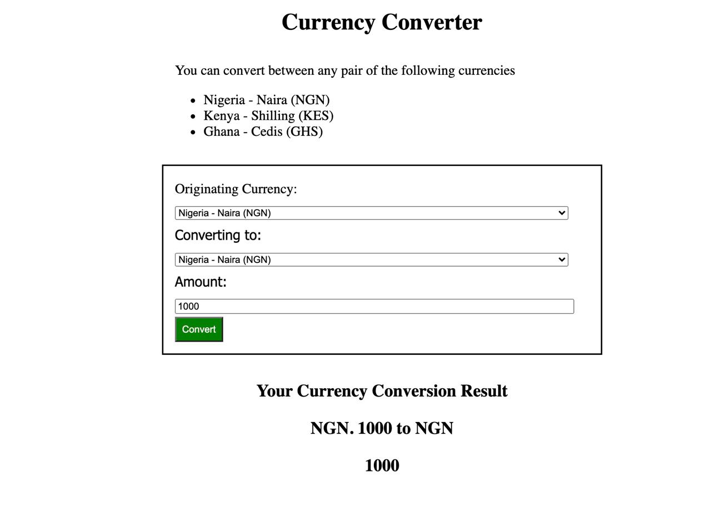
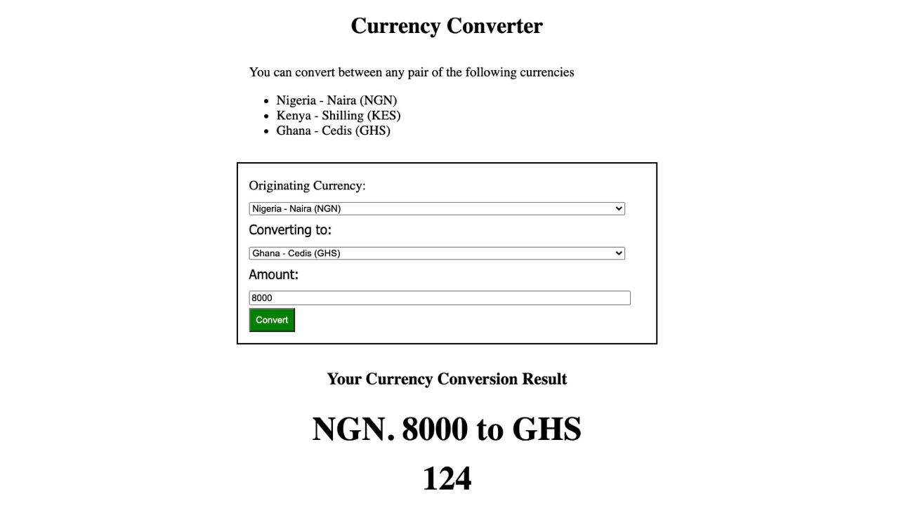
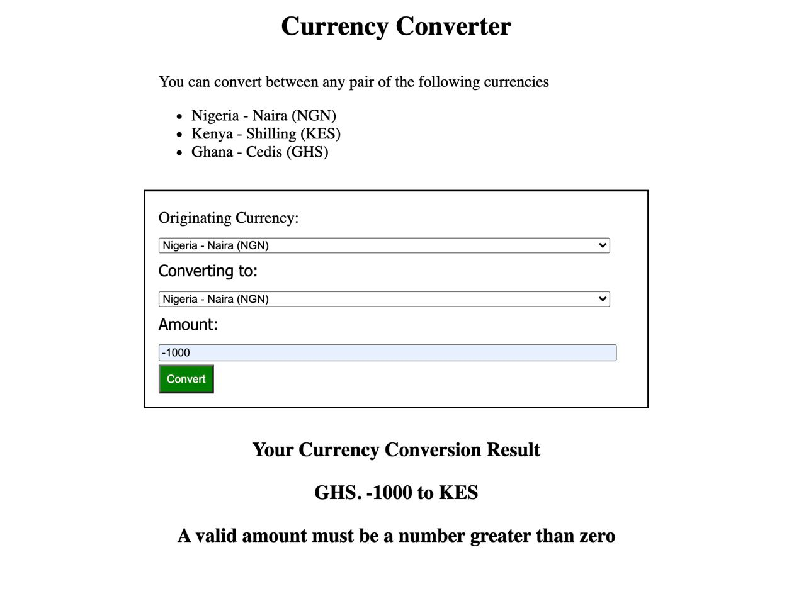

# CurrencyConverter with Golang
This application is designed to convert currencies between Kenya shillings, Nigeria Naira and Ghana Cedis
THe output is displayed in the following formats. 

## Same Currency Conversion 
When a User enters any amount with same currency conversion pair (e.g. NGN->NGN, KES->KES, or GHS->GHS)

## Cross Currency Conversion 
When a User enters any amount with same currency conversion pair (e.g. NGN->KES, GHS->KES, or NGN->GHS)

## Negative User Input
When a User enters a negative amount in the input field
